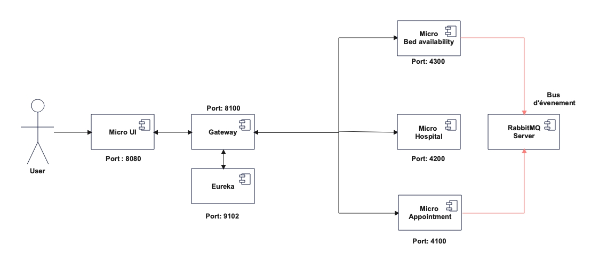

# OpcL_AP11
Projet 11 Architecte logiciel : POC

# Objet de la POC
Ce démonstrateur a pour but de démonter la faisabilité technique d'une architecture multi-layer avec micro-services et gestion d'évènements.
Le scénario est le suivant: le système d'intervention d'urgence en temps réel est destiné à suggérer l'hôpital le plus proche offrant un lit disponible et possédant la spécialisation attendue sur la base d’une banque de données d'informations récentes sur les hôpitaux.

Par exemple, SUPPOSONS trois hôpitaux, comme suit :

| Hopital               | Lits disponibles | Spécialisations                           |
| Hopita Fred Brooks    | 2                | Cardiologie, immunologie                  |
| Hopital Julia Crusher | 0                | Cardiologie                               |
| Hopital Beverly Bashir| 5                | Immunologie, neuropathologie, diagnostic  |

ET un patient nécessitant des soins en cardiologie,
QUAND un patient demande des soins en cardiologie ET que l'urgence est localisée
près de l'hôpital Fred Brooks,
ALORS l'hôpital Fred Brooks devrait être proposé,
ET un événement devrait être publié pour réserver un lit.

# Architecture de la POC
L'architecture micro-service est présentée ci-dessous:

Le micro-service Appointment fournit la liste des lits actuellement réservés et enregistre les nouvelles réservations publiées sur le bus d'évènement.
Le micro-service Hospital fournit la liste des hopitaux par spécialité et le nombre total de lits disponibles. A la première exécution il récupère les données concernant les hopitaux et la liste des spécialités sur l'API publique FHIR esante.gouv.fr.

Le micro-service Bed-availability contient l'algorithme qui va choisir l'hopital le plus proche. Il récupère la liste des hopitaux disposant de la spécialitée demandée auprès du microservice Hospital, la liste des réservations pour la date du jour et la spécialité demandée auprès du microservice Appointement.
Il récupère les données de localisation de l'adresse demandée auprès de l'api publique  api-adresse.data.gouv.fr.
Il calcule la distance entre les hopitaux et l'adresse demandée grâce à la librairie GraphHopper.
A partir de ces données il en déduit l'hopital le plus proche qui possède encore des lits disponibles pour cette spécialité et publie sur le bus d'évènement une réservation concernant l'hopital et la spécialité demandée.

La gateway redirige les requêtes entre les micro-services.

Le micro-service Eureka enregistre les micro-services déployés et assure leur monitoring.

Le micro-service client-ui est l'interface graphique développée avec Angular pour l'envoi d'une demande de recherche d'hopital.

# Prérequis pour l'éxecution de la POC
Une connexion internet doit être disponible pour pouvoir se connecter aux API du FHIR sur esante.gouv.fr et récupérer les coordonnées géographiques d'une adresse sur l'API api-adresse.data.gouv.fr. 
Une clé API doit être générée pour la connexion à l'API du FHIR et pouvoir l'interroger, la valeur de cette clé est renseignée dans le constructeur de la classe HospitalSpecialityLoader du micro-service Hospital. Une clé active est paramétrée par défaut dans la classe.

Une base données MySQL doit être disponible sur la machine sur le port 3306, les informations de connexion sont paramétrées dans le fichier application.properties des microservices appointment et hospital, l'utilisateur "archi_p11" avec le mot de passe "Openclassrooms2026" doit avoir les droits pour créer/modifier des bases de données sur le serveur MySQL.

Un serveur RabbitMQ doit être présent également sur la machine pour la gestion des évènements publiés. L'image docker rabbitmqserver convient parfaitement avec un paramétrage standard et est paramétrée dans le fichier docker compose du repository. Aucune installation n'est nécessaire sur la machine.

Chaque micro-service dispose d'un fichier Dockerfile pour la création d'une image Docker. Un fichier docker-compose est également disponible pour la création et l'exécution de tous les conteneurs en une fois.

# Librairies utilisées:

Graphhopper est utilisé pour le calcul des distances entre les hopitaux et le lieu de l'urgence. La librairie est comprise en tant que dépendance dans le pom du micro-service bed-availability. Un fichier de carte OpenStreetMap est nécessaire pour fournir les données de géolocalisation à la librairie. Le repository contient les données pour l'Alsace, si on veut utiliser d'autres données il faut télécharger un fichier cartographique sur le site web suivant: https://download.geofabrik.de/ au format OSM. Le nom du fichier est écrit directement dans la classe DistanceCalculatorService du domain. Le fichier doit être déposé directement dans le répertoire micro-bed-availbility/.
La librairie GraphHopper utilise des coordonnées en Latitude/Longitude pour faire ses calculs, l'adresse postale doit être préalablement convertie en coordonées géographiques pour la bonne marche de la librairie, pour ce faire une requête est envoyéee à l'API publique api-adresse.data.gouv.fr qui renvoie les coordonées à partir d'une adresse géographique.

Au premier démarrage du micro-service Hospital, un loader va s'éxecuter pour récupérer la liste des hopitaux disponibles dans la région Alsace, et remplir la liste des spécialités médicales. Cette procédure est assez longue et peut prendre plusieurs minutes en fonction du volume de données à récupérer. La région pour laquelle les données sont sollicitées est spécifiée dans la requête envoyée par la procédure loadAllHospitals de la classe HospitalSpecialityLoader dans l'infra. Cette procédure est exécutée uniquement si la base de données est vide, si des données sont présentes cette procédure n'est pas lancée pour économiser le temps d'exécution.

# Installation et lancement
Docker doit être installé et configuré sur la machine.
Faire un clone du repository en local, et exécuter la commande "docker compose up" à la racine du repository.

# Workflow Git:
Le principe Gitflow est utilisé: 
La branche main contient les version finalisées
La branche dev contient le développement en cours
Les fonctionnalités nouvelles sont des branches issues de la branche dev.
Les microservices sont stockés chacun dans un répertoire différent du repository.

# Execution des test:
Les tests unitaires et d'intégration sont mis en place pour les micro-services bed-availability, hospital et appointment.
Une base de données H2 en mémoire est utilisée pour l'éxecution des tests, celle-ci est paramétrée automatiquement par les classes de configuration des tests. Des données de test fictives sont paramétrées par les tests.
Des fichiers application.properties spécifiques aux tests ont été créés pour adapter l'environnement Spring à l'exécution des tests.

# Configuration du pipeline CI/CD
Le pipeline est configuré pour se déclencher sur un push sur la branche main, dev ou les branches dédiées à chaque microservice.
Si un push est fait sur une branche spécifique, seul le micro-service de la branche concerné sera testé et buildé.
Le pipeline s'arrête à la phase de build, aucun déploiement n'est configuré.
